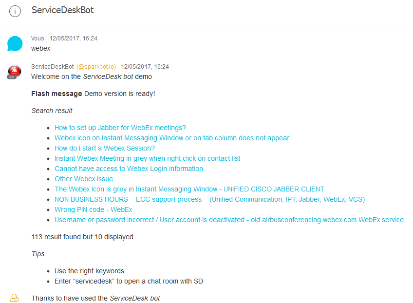
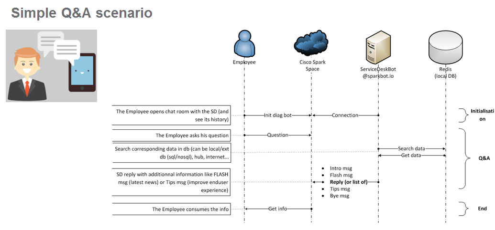
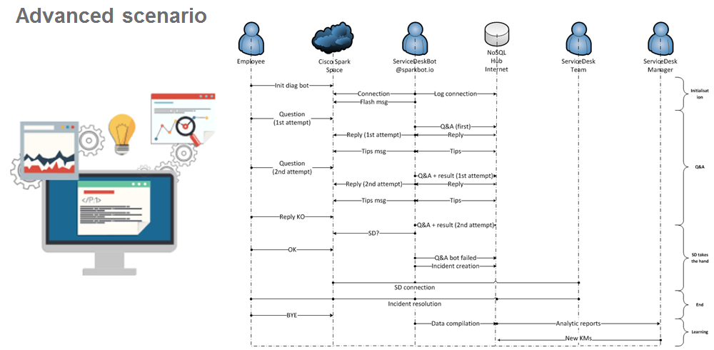

# ServiceDeskBot
Cisco Spark Bot for ServiceDesk

# What is it?
* Q&A chatbot integrated on redis db
* DB can be loaded with csv file
* User can be put in a new room with ServiceDesk (keyword: `joinsd`)
* Tranlsation integrated in 107 languages with auto or manual mode (keyword: `translate help`)
* Based on [node-flint](https://github.com/flint-bot/flint) (nodejs)
* Logstash connector to send all messages in BigData db
* ITSM (servicenow) integration to list, create, update ticket
* Flash message management to inform about current global outage
* 

## Scenario


## Advanced Scenario


## Search
All words other than the keywaord used for the command are used to be searched in the KB source(s)

# Commands
## joinsd
* `joinsd` To open a chat group space with the Service Desk. 
Because we can't let the enduser without door. 
Create automatically an ITSM incident with the content coming from local chat.
New group chat space is create and one ServiceDesk guy is involved to help the end user.

* `joinsd help` The SD's help page.

## CSV
Manage CSV file as source of KM

* `csv load` Load current CSV file as source of data. Useful to update quickly the KB source.

* `csv test` Test current CSV file vs local DB. Run the production safly!

* `csv help` The CSV's help page.

## Incident
Manage the ITSM incident

* `incident list` List ITSM tickets. To follow the last event, update...

* `incident list create [title] [comments]` Create your ticket by chat. 

* `updateticket [id] [comments]` Update the ticket.

* `incident help` The Incident's help page.

## Translate

* `translate state` Display the current state of the auto translation.

* `translate on` Activate the auto translation.

* `translate off` Deactivate the auto translation.

* `translate config` Display the current config.

* `translate config [lang in] [lang out]` Change the current config. The config is also updated when the user perform an manual translation.

* `translate help` The Translate's help page.

## Flash
Display and update the flash message

* `flash` Display the flash messasge.

* `flash update [\/*phrase}` Update the flash message.

* `flash help` The Flash's help page.

## help
* `help` Display the global helpful messsage


# HowTo

## Installation
* Clone localy 
`git clone https://github.com/guillain/ServiceDeskBot.git`

* Go into the folder 
`cd ServiceDeskBot`

## Configuration
* Put your CSV file (named km.csv) in the conf folder (key->txt structure) 
`cp [your CSV file] app/conf/km.csv`

* Config your app with your [spark bot](https://developer.ciscospark.com/apps.html)
`vi app/config.js`

## Running

### PM2 environment

* Install dependencies
`npm install`

* Run the application, two configuration availables

* 1/ For the dev, node is used
`./run.sh manual`

* 2/ For the prod, pm2 is used (install also this dependency)
`./run.sh [start|stop|restart|show|status|log]`

* Add the bot in 1:1 or in chat group room

### Docker
Provided also for Docker env. with the Dockerfile for the standalone builder

To build the image:
`docker build -t bot/servicedesk .`

To run the image:
`docker run -d -p 8083:3333 bot/servicedesk`

To go in the container:
`docker exec -it bot/servicedesk /bin/bash`

To check the logs
`docker logs bot/servicedesk --details -f`

# BigData with Logstash connector embeded
Settings is done to send all chat messages formatted properly to a log stash system.

Thanks to active it in the configuration file
```bash
config.js
> config.bigdata.enable = true;
```

## Current issue
* `incident create title comments` callback fct to fix
* flint Redis storage (issue: https://github.com/flint-bot/flint/issues/22). Thanks to use the old redis.js file as workaround.

# CREDITS

## Cisco Spark
* http://developer.ciscospark.com/
* https://github.com/flint-bot/flint
* https://github.com/flint-bot/sparky

## Google
* https://cloud.google.com/translate
* https://github.com/statickidz/node-google-translate-skidz

## Redis
* https://github.com/NodeRedis/node_redis

## Done


## ToDo


Have fun
